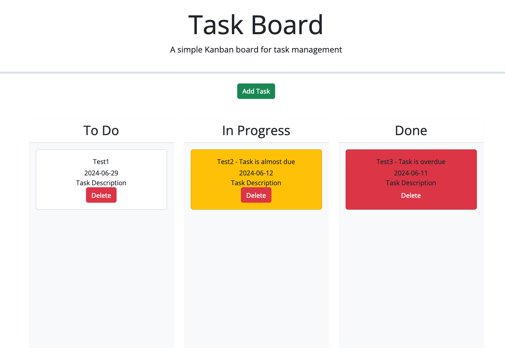

# C5-Task-Board

## Project Description

This is a simple project that involves creating a task board to manage multiple tasks efficiently. The task board display's tasks in columns representing their progress states (Not Yet Started, In Progress, Completed), and tasks are color-coded based on their deadlines. Users can add, edit, and delete tasks, and the task states persist across page refreshes using localStorage.

## Features

- Display tasks in columns based on their progress state.
- Color-code tasks based on their proximity to deadlines.
- Add new tasks with a title, description, and deadline.
- Edit existing tasks.
- Delete tasks.
- Drag-and-drop functionality to move tasks between progress columns.
- Persistent task state using localStorage.

## Usage

1. Open the task board via the deployed link below.
2. Add a new task by clicking the “Add Task” button and filling in the task details.
3. Tasks will display in the “To Do” column.
4. Drag tasks between columns to update their progress state.
5. Edit or delete tasks as needed.
6. Task states and details persist across page refreshes.

## Deployed Page

[Deployed GitHub Page]()

## Source Code

- Base code provided by: [The Coding Bootcamp](https://github.com/coding-boot-camp/musical-happiness)
- Modifications by [Lixiviate](https://github.com/Lixiviate)
- Code assistance from:
  - [Bootstrap](https://getbootstrap.com)
  - [jQuery API](https://api.jquery.com/)
  - [Day.js](https://day.js.org/)
  - [MDN Web Docs](https://developer.mozilla.org/en-US/)
  - [W3 Schools](https://www.w3schools.com/)
  - [edX Xpert Learning Assistant](https://www.edx.org/)
